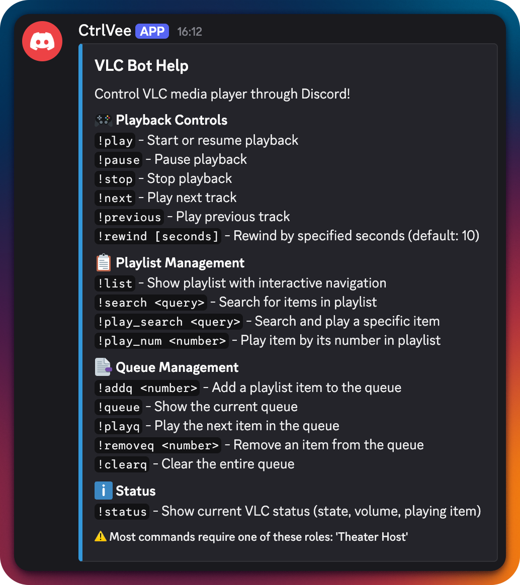

# CtrlVee - a Discord VLC Bot

A Discord bot that controls VLC media player, manages playlists, provides movie metadata integration, and features an intelligent queue system on Windows, macOS, and Linux. This idea was due to a need for users on a discord server to be able to control the screen shared VLC setup I have even if I am away. It allows more options for them for viewing instead of just relying on the randomness of the playlist. It also allows me to not be around or remoting into that computer all the time. I have not seen this to be available and it makes sense because you need to have local access to the host where VLC is running. I used Github Copilot to build this and refine the bot. It used to be just one single python file, but after asking it to be refactored, it rebuilt and implemented it in a more proper way. 


## Features
- **VLC Playback Control**
   ...existing code...

- **Scheduling Movies**
   - Schedule a movie by playlist number and PH time with `!schedule <number> <YYYY-MM-DD> <HH:MM>`
   - Prevents double-booking the same movie at the same time
   - Shows movie duration in schedule and confirmation
   - Schedules persist across bot restarts
   - When a scheduled movie is played, the bot posts a TMDB metadata embed
   - `!schedules` to list all upcoming scheduled movies
   - `!unschedule <number>` to remove all schedules for a movie

- **VLC Playback Control**
  - Basic controls (play, pause, stop, restart)
  - Navigate playlist (next, previous)
  - Jump to specific items using numbers
  - Rewind playback with customizable seconds
  - Shuffle mode control (enable, disable, toggle)
  - Progress display with timestamps and enhanced status

- **Intelligent Queue System**
  - Queue items to play next with automatic shuffle handling
  - Soft queue implementation compatible with VLC 3.x
  - Automatic shuffle restoration after queued items finish
  - Queue persistence across bot restarts
  - Real-time queue status with item titles and positions

- **Movie Information**
  - Automatic movie metadata lookup via TMDB
  - Movie posters, release dates, and ratings
  - Direct links to TMDB movie pages

-- **Playlist Management**
   - View and navigate existing VLC playlist with pagination
   - List all items with interactive navigation buttons
   - Quick replay of items using item numbers
   - Search and filter playlist contents
   - Play search results directly
   - **Media Library Size**: See the total size of all watched folders in `!list` and `!status` commands
  
- **Enhanced State Monitoring**
  - Track VLC state changes with cooldown protection
  - Notify about manual interventions and queue transitions
  - Configurable notification channel
  - State change history and queue event tracking
  - Automatic detection of media ending and queue handling
  
- **Watch Folders (Optional)**
   - Polls configured folders for new media files
   - Automatically enqueues discovered files into VLC
   - Lightweight polling (no extra dependencies)
   - **Hot reloading**: Add new folders to `.env` and they are picked up live, no restart needed
   - **Progress logging**: See N/total progress for each file enqueued in logs
   - If exactly one item is added in a scan, the bot posts a TMDB metadata embed for it (when TMDB is configured)

- **Playlist Autosave (Optional)**
   - Periodically saves the current VLC playlist to a file
   - If `PLAYLIST_AUTOSAVE_FILE` ends with `.xspf`, a valid XSPF playlist is written (directly loadable in VLC)
   - Otherwise a JSON export is written with basic fields (id, name, current)
   - Control frequency with `PLAYLIST_AUTOSAVE_INTERVAL` (seconds; minimum 10)

## Screenshots

### Bot Commands and Help



## Prerequisites

- Python 3.6 or higher (Windows, macOS, or Linux)
- VLC media player installed (Windows, macOS, or Linux)
- Discord bot token

## Python Installation

If you do not have Python 3 installed, follow these steps for your platform **before** continuing:

### Linux (Ubuntu/Debian)
```sh
sudo apt update
sudo apt install python3 python3-venv python3-pip
```

### Linux (Fedora)
```sh
sudo dnf install python3 python3-venv python3-pip
```

### macOS (with Homebrew)
```sh
brew install python
```

### Windows
1. Download Python from https://www.python.org/downloads/
2. Run the installer and **check the box that says "Add Python to PATH"**
3. Complete the installation

After installing, verify with:
```sh
python3 --version
# or on Windows
python --version
```

### Discord Bot Setup
1. Go to [Discord Developer Portal](https://discord.com/developers/applications)
2. Create a new application or select your existing one
3. Go to the "Bot" section
4. Enable the following Privileged Intents:
   - MESSAGE CONTENT INTENT
5. Under "Bot Permissions", enable:
   - Read Messages/View Channels
   - Send Messages
   - Embed Links
   - Read Message History

### VLC Setup
1. Open VLC Media Player
2. Go to Preferences (or Settings)
3. Enable the Web Interface:
   - On macOS: VLC > Preferences > Interface > Main Interfaces > check "Web"
   - On Windows: Tools > Preferences > Interface > Main Interfaces > check "Web"
4. Set a password (optional but recommended)
5. Restart VLC after making these changes


### macOS/Linux Specific Setup
- On macOS: Install VLC from the official website or using Homebrew: `brew install --cask vlc`
- On Linux: Install VLC using your package manager, e.g. `sudo apt install vlc` (Debian/Ubuntu) or `sudo dnf install vlc` (Fedora)
- Make sure VLC is installed in your system PATH

## Installation

1. Clone this repository


2. Set up Python environment:
   ```sh
   # Create a virtual environment (recommended)
   python3 -m venv venv
   
   # Activate the virtual environment
   # On Windows:
   .\venv\Scripts\activate
   # On macOS/Linux:
   source venv/bin/activate
   ```

3. Install Python dependencies:
   ```sh
   # Make sure pip is up to date
   python3 -m pip install --upgrade pip

   # Install all required packages
   python3 -m pip install -r requirements.txt

   # If you get "no module named audioop" error (rare, usually on Linux), run:
   python3 -m pip install audioop-lts
   ```

4. Set up your configuration:
   ```bash
   # Copy the template environment file
   cp template.env .env
   
   # Edit the .env file with your settings
   nano .env   # or use any text editor
   ```
   
   Required Configuration:
   - `DISCORD_TOKEN`: Your Discord bot token
   - `TMDB_API_KEY`: Your TMDB API key (optional, but recommended for movie metadata)
   
   Optional Configuration:
   - `ALLOWED_ROLES`: Comma-separated list of roles that can control playback (default: "Theater Host")
   - `VLC_HOST`: VLC HTTP interface host (default: localhost)
   - `VLC_PORT`: VLC HTTP interface port (default: 8080)
   - `VLC_PASSWORD`: VLC HTTP interface password (default: vlc)
   - `QUEUE_BACKUP_FILE`: Path to queue backup file (default: queue_backup.json)
   - `ITEMS_PER_PAGE`: Number of items per page in playlist view (default: 20)
   - `WATCH_FOLDERS`: Comma-separated absolute paths to watch (optional)
   - `WATCH_SCAN_INTERVAL`: Poll interval in seconds (default: 10)
   - `WATCH_ENQUEUE_ON_START`: If true, enqueue files discovered on the first scan (default: true)
   - `WATCH_ANNOUNCE_CHANNEL_ID`: Comma-separated list of Discord channel IDs for adding-file announcements (e.g. `123456789,987654321`). Set to 0 or leave empty to disable. **(v1.0.0: Now supports multiple channels!)**
   - `WATCH_ANNOUNCE_MAX_ITEMS`: Max file paths to show per announcement (default: 10)
   - `DISCORD_COMMAND_PREFIX`: The command prefix for bot commands (default: `!`). You can set this to any string, e.g. `!!` or `$`. Multi-character prefixes are supported.
   - `PLAYLIST_AUTOSAVE_FILE`: Path (absolute or relative to project root) to save the current playlist. If it ends with `.xspf`, an XSPF playlist is written; otherwise JSON. Leave blank to disable.
   - `PLAYLIST_AUTOSAVE_INTERVAL`: Interval in seconds between autosaves (min 10; default 300)

## Usage

1. Start the bot:
   ```
   python bot.py
   ```
   The command prefix can be customized via the `DISCORD_COMMAND_PREFIX` variable in your `.env` file. For example, set `DISCORD_COMMAND_PREFIX=!!` to use `!!play`, `!!pause`, etc.


2. Available commands in Discord:

   **Playback Controls:**
   - `!play` - Start/resume playback
   - `!pause` - Pause playback
   - `!stop` - Stop playback
   - `!next` - Play next item
   - `!previous` - Play previous item
   - `!restart` - Restart current file from beginning
   - `!rewind [seconds]` - Rewind by specified seconds (default: 10)
   - `!forward [seconds]` - Fast forward by specified seconds (default: 10)
   - `!play_num <number>` - Play specific item by number
   - `!shuffle` - Toggle shuffle mode on/off
   - `!shuffle_on` - Enable shuffle mode
   - `!shuffle_off` - Disable shuffle mode

   **Playlist Management:**
   - `!list` - Show playlist with interactive navigation (⏮️, ◀️, ▶️, ⏭️ buttons)
   - `!search <query>` - Search playlist
   - `!play_search <query>` - Search and play first match

   **Queue Management:**
   - `!queue_next <number>` - Queue a playlist item to play next (temporarily disables shuffle if needed)
   - `!queue_status` - Show current queue with item titles and playlist positions
   - `!clear_queue` - Clear all queue tracking
   - `!remove_queue <N|#N>` - Remove by queue order (N) or playlist number (#N)

   **Scheduling:**
   - `!schedule <number> <YYYY-MM-DD> <HH:MM>` - Schedule a movie by playlist number and PH time
   - `!schedules` - List all upcoming scheduled movies
   - `!unschedule <number>` - Remove all schedules for a movie

   **Status & Information:**
   - `!status` - Show current VLC status (state, volume, playing item)
   - `!version` - Show bot version and key config info
   - `!controls` - Show this help message

   **Notification Settings:**
   - `!set_notification_channel` - Set current channel for VLC state notifications
   - `!unset_notification_channel` - Disable notifications
   - `!show_notification_channel` - Show notification settings

## Known Issues

- **Metadata Matching**: Movie metadata from TMDB may not always match the actual media file. This occurs due to how media file names are parsed and handled by the system. File names with non-standard formatting, special characters, year mismatches, or quality indicators (like "1080p", "BluRay") can interfere with accurate metadata retrieval. This is a known limitation that we plan to improve in future versions by implementing better file name parsing and fuzzy matching algorithms.


## Recent Improvements

- **v1.5.0: Playlist Autosave + Watch-Folder Robustness**
   - New autosave feature: save to XSPF (preferred) or JSON periodically via `PLAYLIST_AUTOSAVE_FILE` and `PLAYLIST_AUTOSAVE_INTERVAL`
   - Info-level logs indicate when and where the playlist is saved
   - More robust watch-folder hot reload and prevention of duplicate enqueues when changing folder order

- **v1.0.0 (Breaking Change): Multi-Channel Announcements & Config Refactor**
   - Announcements can now be sent to multiple Discord channels. Set `WATCH_ANNOUNCE_CHANNEL_ID` in `.env` to a comma-separated list of channel IDs.
   - The config variable for announce channels is now always loaded dynamically at runtime.
   - The bot prints the resolved announce channel IDs as a list on startup for easier debugging.
   - **Migration:** Update your `.env` to use `WATCH_ANNOUNCE_CHANNEL_ID=123,456,...` (comma-separated, no spaces). Update any custom code to use `Config.get_announce_channel_ids()`.
   - **Breaking:** `Config.WATCH_ANNOUNCE_CHANNEL_ID` is no longer a static class variable; use the static method instead.

- **Enhanced Queue System**: Implemented intelligent soft queue management with automatic shuffle handling and restoration
- **Code Refactoring**: Major cleanup removed debug commands, simplified user messaging, and improved code organization
- **Better Error Handling**: Consolidated HTTP request logic with consistent error handling across all VLC operations  
- **UI Cleanup**: Streamlined queue status display to show only essential information without technical implementation details
- **Improved Monitoring**: Enhanced state monitoring with cooldown protection and better queue transition detection
- **Queue Persistence**: Queue state is now automatically saved and restored across bot restarts
- **Filename Cleanup**: Strip HC/hardsub markers and additional torrent/scene noise from display and TMDB search inputs; preserves numeric title tokens (e.g., "2 Fast 2 Furious")
- **Pagination Config**: `ITEMS_PER_PAGE` from `.env` now controls playlist page size (default remains 20)
- **Media Size Caching**: Media library size is now cached and updated after each scan, making `!status` and `!list` instant even for large libraries
- **Hot Watch Folder Reloading**: Add new folders to `.env` and they are picked up live, no restart needed
- **Log Progress**: Each file enqueued from watch folders logs its progress (N/total)

## Versioning and Releases

- The project follows Semantic Versioning (MAJOR.MINOR.PATCH) stored in `src/version.py`.
- Check the current version with the `!version` command in Discord.
- Release workflow:
   1. Update `src/version.py` with the new version.
   2. Update `README.md` and `CHANGELOG.md` with notable changes.
   3. Commit and push.
   4. Create a Git tag, e.g., `git tag vX.Y.Z && git push origin vX.Y.Z`.
   5. Optionally draft a GitHub Release pointing to the tag.

## Contributing

Contributions are welcome! Please feel free to submit a Pull Request. For major changes, please open an issue first to discuss what you would like to change.

## Notes

- The bot uses TMDB for movie metadata. You'll get better results if your media files are named accurately.
- VLC's HTTP interface must be enabled for the bot to function.
- The bot works with VLC's existing playlist - add your media files directly through VLC.
- **Cross-platform**: CtrlVee works on Windows, macOS, and Linux. All setup and commands are supported on Linux as well.
- **Queue System**: Uses a soft queue approach compatible with VLC 3.x that temporarily disables shuffle when needed and automatically restores it after queued items finish playing.
- **State Monitoring**: Enhanced monitoring helps track manual changes made directly in VLC and automatically handles queue transitions.
- **Role-Based Access**: Most commands require specific Discord roles (configurable via `ALLOWED_ROLES` in `.env`).
- **Queue Persistence**: Queue state is automatically saved to `queue_backup.json` and restored when the bot restarts.
- **Watch Folders**: When `WATCH_FOLDERS` is set, the bot runs a lightweight watcher that scans every `WATCH_SCAN_INTERVAL` seconds. New media files are enqueued once they appear stable (size unchanged for ~2s). Hidden files and folders are ignored. Supported extensions include common video/audio types (mp4, mkv, avi, mov, mp3, flac, etc.). You can control whether the initial scan also enqueues existing files via `WATCH_ENQUEUE_ON_START`.

## License

This project is licensed under the MIT License - see the LICENSE file for details.

## Acknowledgments

This bot was built with assistance from GitHub Copilot.
